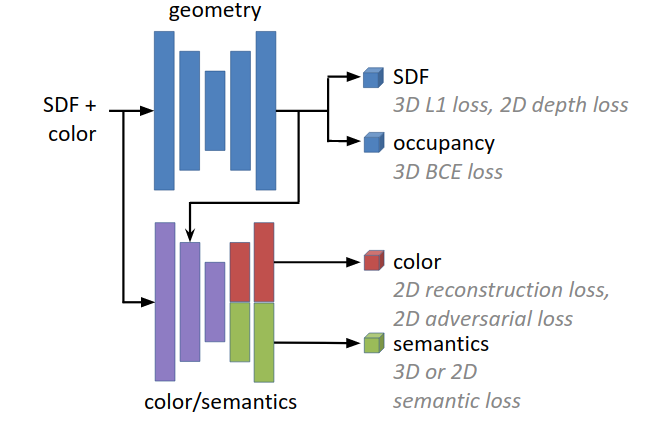

# Self Supervised Scene Generation with Semantic Segmentation

This repository contains an extension of the paper
[SPSG: Self-Supervised Photometric Scene Generation from RGB-D Scans](https://arxiv.org/pdf/2006.14660).
SPSG introduces a self-supervised approach to generate high-quality, colored 3D models of scenes from RGB-D scan observations by learning to infer unobserved scene geometry and color. 
Rather than relying on 3D reconstruction losses to inform 3D geometry and color reconstruction, it proposes adversarial and perceptual losses operating on 2D renderings in order to achieve high-resolution, high-quality colored reconstructions of scenes.

We extended the available code to be able to predict semantic information.
The semantic predictions are trained using a semantic loss either operating on 2D renderings or simply the 3D semantics.
There are scripts available to extend the data used by SPSG with semantic information, namely [extend_sdfs.py](torch/extend_sdfs.py) and [extend_sdfs_2cm.py](torch/extend_sdfs_2cm.py).



## Code
### Installation:  
Training is implemented with [PyTorch](https://pytorch.org/). This code was developed under PyTorch 1.11.0 and Python 3.8.13.

Please compile the extension modules by running the [install_utils.sh](torch/install_utils.sh) script.


### Training:  
* See `python train.py --help` for all train options. 
* Example command: `python train.py --data_path ./data/data-extended --frame_info_path ./data/data-frames --train_file_list ../filelists/train_list.txt --val_file_list ../filelists/val_list.txt --save_epoch 1 --save logs/mp --max_epoch 5`

### Testing
* See `python test_scene_as_chunks.py --help` for all test options. 
* Example command: `python test_scene_as_chunks.py --input_data_path ./data/mp_sdf_2cm_input --target_data_path ./data/mp_sdf_2cm_target_extended --test_file_list ../filelists/mp-rooms_val-scenes.txt --model_path model.pth --output ./output`

### Original Data used by SPSG:
* Scene data: 
  - [mp_sdf_2cm_input.zip](http://kaldir.vc.in.tum.de/adai/SPSG/mp_sdf_2cm_input.zip) (68G)
  - [mp_sdf_2cm_target.zip](http://kaldir.vc.in.tum.de/adai/SPSG/mp_sdf_2cm_target.zip) (87G)
* Train data:
  - [data-geo-color.zip](http://kaldir.vc.in.tum.de/adai/SPSG/data-geo-color.zip) (110G)
  - [data-frames.zip](http://kaldir.vc.in.tum.de/adai/SPSG/data-frames.zip) (11M)
  - [images.zip](http://kaldir.vc.in.tum.de/adai/SPSG/images.zip) (12G)
* Data generation code: [datagen](datagen)
  - Developed in Visual Studio 2017
  - Dependencies: Microsoft DirectX SDF June 2010, [mLib](https://github.com/niessner/mLib)
  - Downlaod the [Matterport3D](https://github.com/niessner/matterport) dataset and edit the corresponding file paths in [datagen/zParametersScanMP.txt](datagen/zParametersScanMP.txt). Note that the mesh files must have the face attributes removed to generate the `*.reduced.ply` files.

## SPSG Citation:  
```
@inproceedings{dai2021spsg,
    title={SPSG: Self-Supervised Photometric Scene Generation from RGB-D Scans},
    author={Dai, Angela and Siddiqui, Yawar and Thies, Justus and Valentin, Julien and Nie{\ss}ner, Matthias},
	booktitle={Proc. Computer Vision and Pattern Recognition (CVPR), IEEE},
	year={2021}
}
```
